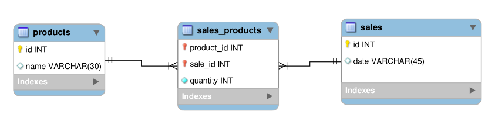

# Store Manager #


## About ##

In this project was developed an API to manage sales where is possible to create, view, delete and update products and sales. This API was made in Node.js following software architecture model MSC. 

## ER and Entity Diagram ##

The relational database used in the project has its relationships and entities represented in the figure below. Endpoints were developed to connect to the database following REST principles.



## Guidelines to runnig API ##

This project can be run locally or using docker. Whichever resource you choose, both use environment variables. To runnig this API, follow these steps below:

### :whale: Docker ###

1. Clone the repository: ```git clone git@github.com:carinacunha/store-manager.git```
2. Navigate to the root of the repository: ```cd store-manager```
3. Make sure you have installed docker version 1.29 or higher
4. Run the node and db services: ```docker-compose up -d --build```
5. Create an interactive terminal from the container: ```docker exec -it store-manager bash```
6. Install the dependencies: ```npm install```

### :computer: Local ###

1. Clone the repository: ```git clone git@github.com:carinacunha/store-manager.git```
2. Navigate to the root of the repository: ```cd store-manager```
3. Make sure you have installed node version 16
4. Install the dependencies: npm install
5. Rename the file .env.example to .env and set the environment variables

**✨ This project was developed during the Full Stack Web Development course at Trybe.**
